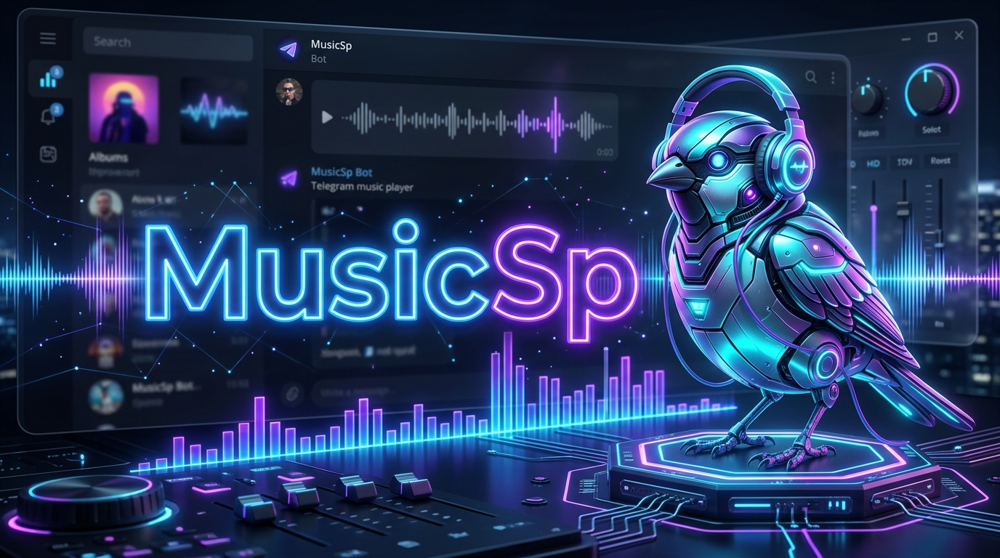
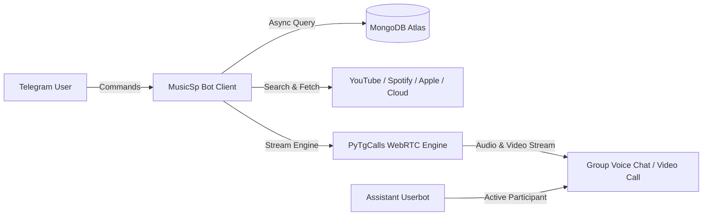

<h1 align="center">
  
</h1>

<p align="center">
  
</p>

<p align="center">
  
</p>

<p align="center">
  <b>🎵 High-Performance Telegram Voice Chat Music & Video Streaming Bot</b>
  <br>
  <i>Powered by Python, Kurigram, and PyTgCalls (Developer Sparrow Core)</i>
</p>

<p align="center">
  <a href="https://github.com/DevloperSP/MusicSp/stargazers"></a>
  <a href="https://github.com/DevloperSP/MusicSp/network/members"></a>
  <a href="https://github.com/DevloperSP/MusicSp/blob/main/LICENSE"></a>
  <a href="https://python.org"></a>
  <a href="https://t.me/Mecobots"></a>
</p>

---

## 📖 Introduction to MusicSp

**MusicSp** *(also recognized as **Sparrow Music Bot** / **Developer Sparrow Core**)* is a modern, high-speed open-source Telegram Voice Chat Music and Video Player built with **Python 3**. Utilizing **Kurigram / Pyrogram** for Telegram MTProto operations and **PyTgCalls** for low-latency WebRTC media streaming, MusicSp delivers an uninterrupted, crystal-clear listening experience in Telegram groups, channels, and supergroups.

Whether you are hosting a live radio stream, watching music videos with friends, or managing audio queues in large communities, MusicSp provides seamless playback, interactive colourful inline buttons, and automated multi-assistant scaling.

---

## ⚡ Key Highlights & Features

- 🎧 **Multi-Platform Music Playback**: Stream songs and audio from **YouTube**, **Spotify**, **Apple Music**, **SoundCloud**, **Resso**, and **Telegram Direct Media** files.
- 📺 **Dual Mode Audio & HD Video Streaming**: Support for both standard voice chat audio (`/play`) and high-definition video chat streaming (`/vplay`).
- 🎨 **Colourful Interactive Inline UI**: Intuitive inline control buttons with `ButtonStyle` styling and custom Telegram emojis for Play, Pause, Skip, Stop, and Settings.
- 🚀 **Multi-Assistant Architecture**: Configure up to 5 assistant sessions (`STRING_SESSION` to `STRING_SESSION5`) for automatic load balancing across multiple active calls.
- 🎚️ **Live Playback Controls**: Real-time seeking (`/seek`), speed alteration (`/speed` from 0.5x to 2.0x), track looping (`/loop`), and random queue shuffling (`/shuffle`).
- 📜 **Personal & Group Playlist Support**: Save your favorite songs to personal MongoDB playlists and play entire collections with a single command (`/playlist`).
- 🌐 **Multilingual System**: Localized response strings supporting multiple languages for global Telegram communities.
- 🛡️ **Ultra-Fast & Crash-Resistant**: Fully asynchronous architecture backed by `Motor` (async MongoDB) and isolated `.venv` deployment mechanisms.

---

## 📻 Supported Streaming Platforms

| Source Platform | Audio Stream | Video Stream | Playlist Support | Input Methods |
| :--- | :---: | :---: | :---: | :--- |
| **YouTube** | ✅ | ✅ | ✅ | Track Link, Playlist Link, Song Title Search |
| **Spotify** | ✅ | ❌ | ✅ | Track Link, Album Link, Playlist Link, Artist Link |
| **Apple Music** | ✅ | ❌ | ✅ | Song Link, Playlist Link |
| **SoundCloud** | ✅ | ❌ | ❌ | Track Link |
| **Resso** | ✅ | ❌ | ❌ | Track Link |
| **Telegram Files** | ✅ | ✅ | ❌ | Audio, Video, Voice Notes, File Documents |

---

## 🛠️ Bot Commands Reference

### 🎵 General User Commands

| Command | Action |
| :--- | :--- |
| `/play <query/link>` | Stream audio in group voice chat. |
| `/vplay <query/link>` | Stream HD video in group voice chat. |
| `/cplay <query/link>` | Stream audio in linked channel voice chat. |
| `/cvplay <query/link>` | Stream video in linked channel voice chat. |
| `/queue` | Display currently queued tracks. |
| `/playlist` | Open your personal saved playlist menu. |
| `/lyrics <song name>` | Search and fetch synchronized song lyrics. |
| `/ping` | Check bot latency, CPU load, and server uptime. |
| `/stats` | View global bot usage metrics. |
| `/settings` | Open interactive chat preferences. |
| `/help` | Display the interactive help panel. |
| `/repo` | Show official repository details. |

### 🎛️ Admin & Playback Controls

| Command | Action |
| :--- | :--- |
| `/pause` | Temporarily pause current track. |
| `/resume` | Resume playback from paused state. |
| `/skip` | Skip current track and play next in queue. |
| `/end` or `/stop` | End stream and clear active queue. |
| `/mute` | Mute assistant in voice chat. |
| `/unmute` | Unmute assistant in voice chat. |
| `/seek <seconds>` | Jump forward or backward in active track. |
| `/speed <0.5x - 2.0x>` | Adjust stream playback tempo. |
| `/loop <1-10 / disable>` | Repeat current track or active queue. |
| `/shuffle` | Randomize the order of queued tracks. |

### 🔐 Sudo & Owner Management

| Command | Action |
| :--- | :--- |
| `/broadcast <text>` | Broadcast an announcement to all served chats. |
| `/gban <user_id>` | Global ban malicious users across all bot chats. |
| `/ungban <user_id>` | Remove global ban from a user ID. |
| `/restart` | Restart bot and assistant sessions cleanly. |
| `/update` | Pull and merge latest updates from Git upstream. |
| `/logs` | Retrieve recent execution error and activity logs. |

---

## 🏛️ System Architecture



- **Framework**: [Kurigram](https://github.com/kurigram/kurigram) / [Pyrogram](https://github.com/pyrogram/pyrogram) MTProto Client
- **Voice Calling Engine**: [PyTgCalls](https://github.com/pytgcalls/pytgcalls) & [NTgCalls](https://github.com/pytgcalls/ntgcalls)
- **Database**: [MongoDB](https://www.mongodb.com) with [Motor](https://motor.readthedocs.io/) async driver
- **Media Engine**: `yt-dlp`, `ffmpeg`, `py-yt-search`, `spotipy`
- **Environment**: Python 3.10+ / 3.12 (Virtualenv Isolated)

---

## 🚀 Deployment & Installation

### 1. One-Click Deploy to Heroku

Deploy **MusicSp** directly on Heroku with a single click:

<p align="center">
  <a href="https://dashboard.heroku.com/new?template=https://github.com/DevloperSP/MusicSp">
    
  </a>
</p>

---

### 2. VPS Deployment (Ubuntu 24.04 / 22.04 LTS / Debian)

MusicSp includes automated environment scripts (`setup` & `start`) that configure an isolated `.venv` to prevent PEP 668 restrictions:

```bash
# Step 1: Update system packages
sudo apt-get update && sudo apt-get upgrade -y

# Step 2: Clone MusicSp repository
git clone https://github.com/DevloperSP/MusicSp
cd MusicSp

# Step 3: Run automated setup installer (creates .venv & installs dependencies)
bash setup

# Step 4: Configure environment variables
cp sample.env .env
vi .env

# Step 5: Start the bot
bash start
```

---

### 3. Docker Deployment

Deploy with containerization using the pre-configured [`Dockerfile`](Dockerfile):

```bash
# Clone the repository
git clone https://github.com/DevloperSP/MusicSp
cd MusicSp

# Prepare environment file
cp sample.env .env
vi .env

# Build and run Docker container
docker build -t musicsp .
docker run -d --name musicsp_bot --env-file .env musicsp
```

---

## ⚙️ Environment Variables Reference

| Variable | Required | Default | Purpose |
| :--- | :---: | :---: | :--- |
| `API_ID` | **Yes** | — | Telegram API ID from [my.telegram.org](https://my.telegram.org). |
| `API_HASH` | **Yes** | — | Telegram API Hash from [my.telegram.org](https://my.telegram.org). |
| `BOT_TOKEN` | **Yes** | — | Telegram Bot Token from [@BotFather](https://t.me/BotFather). |
| `OWNER_ID` | **Yes** | — | Telegram numeric ID of the bot owner. |
| `MONGO_DB_URI` | **Yes** | — | MongoDB Atlas connection URI string. |
| `LOG_GROUP_ID` | **Yes** | — | Telegram Private Group ID for logging (e.g., `-100xxxxxxx`). |
| `STRING_SESSION` | **Yes** | — | Pyrogram v2 String Session for Assistant 1. |
| `STRING_SESSION2` - `5` | Optional | `None` | Multi-assistant string sessions for load balancing. |
| `SPOTIFY_CLIENT_ID` | Optional | `None` | Spotify Developer API Client ID. |
| `SPOTIFY_CLIENT_SECRET`| Optional | `None` | Spotify Developer API Client Secret. |
| `API_URL` | Optional | `None` | Custom YouTube audio extraction API URL. |
| `API_KEY` | Optional | `None` | Authentication Key for custom YouTube API. |
| `DURATION_LIMIT` | Optional | `1700` | Maximum song duration limit in minutes. |
| `AUTO_LEAVING_ASSISTANT`| Optional | `False` | Auto-leave voice chat assistant when call terminates. |

---

## ❓ Frequently Asked Questions

<details>
<summary><b>1. How does MusicSp solve the Ubuntu 24.04 PEP 668 error?</b></summary>
<br>
Modern Linux systems enforce PEP 668 to protect system packages. MusicSp's <code>bash setup</code> automatically creates and manages an isolated <code>.venv</code> virtual environment, and <code>bash start</code> executes the bot via <code>.venv/bin/python</code>.
</details>

<details>
<summary><b>2. Why is the Assistant account not playing in the voice chat?</b></summary>
<br>
Ensure the Assistant account (from <code>STRING_SESSION</code>) has joined the group, the group voice chat is already started, and the bot has permissions to manage voice chats.
</details>

<details>
<summary><b>3. Can I use custom cookies or YouTube download APIs?</b></summary>
<br>
Yes! You can configure <code>API_URL</code> and <code>API_KEY</code> in your <code>.env</code> file for lightning-fast external audio resolution.
</details>

---

## 🤝 Contributing

We welcome community contributions to **MusicSp**!

1. 🍴 **Fork the Project** to your GitHub account.
2. 🌿 **Create a Branch**: `git checkout -b feature/cool-feature`
3. ✍️ **Commit Changes**: `git commit -m 'Add cool feature'`
4. 🚀 **Push Branch**: `git push origin feature/cool-feature`
5. 📬 **Submit a Pull Request** to our `main` branch.

---

## 📄 License & Credits

- **License**: Released under the [GNU Affero General Public License v3.0 (AGPL-3.0)](LICENSE).
- **Core Engine**: Built & maintained with ❤️ by [DevloperSP](https://github.com/DevloperSP) (**Developer Sparrow**).

---

## 💬 Community & Support

<p align="center">
  <a href="https://t.me/Mecobots">
    
  </a>
  <a href="https://t.me/Spparow_92">
    
  </a>
  <a href="https://t.me/MusicSp1_bot">
    
  </a>
</p>
