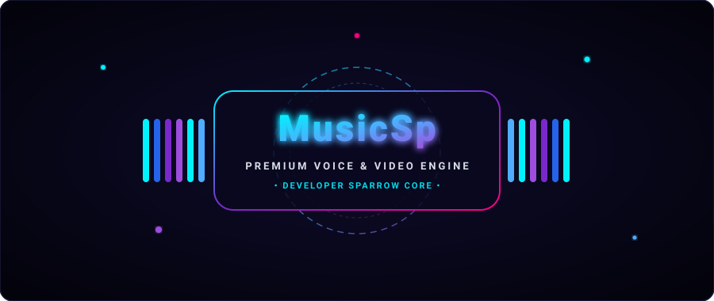
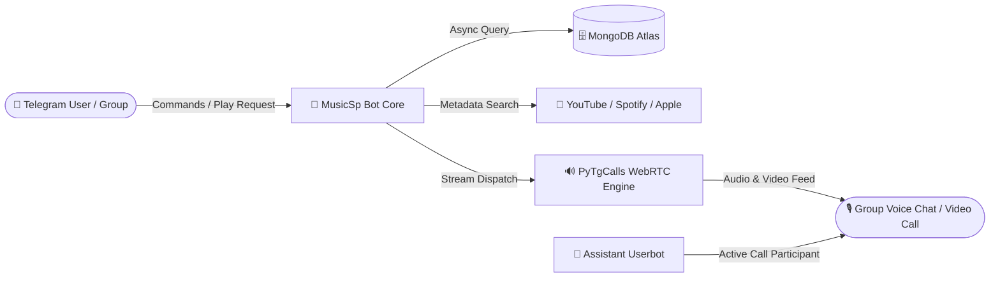

<p align="center">
  
</p>

<div align="center">
  
</div>

---

<p align="center">
  <a href="https://github.com/DevloperSP/MusicSp/stargazers"></a>
  <a href="https://github.com/DevloperSP/MusicSp/network/members"></a>
  <a href="https://github.com/DevloperSP/MusicSp/blob/main/LICENSE"></a>
  <a href="https://python.org"></a>
  <a href="https://t.me/Mecobots"></a>
</p>

<div align="center">

> ⚡ **Response Speed:** `1-2 Seconds` | 🚀 **Uptime:** `99.9% High Availability` | 💎 **Audio Quality:** `Lossless 320kbps + 1080p HD Video`

</div>

---

## 🎛️ 𝑪𝒐𝒎𝒎𝒂𝒏𝒅𝒔 & 𝑼𝒔𝒂𝒈𝒆 𝑴𝒂𝒏𝒖𝒂𝒍

<details>
<summary><b>🎵 𝑼𝒔𝒆𝒓 𝑷𝒍𝒂𝒚𝒃𝒂𝒄𝒌 𝑪𝒐𝒎𝒎𝒂𝒏𝒅𝒔 (Click to Expand)</b></summary>
<br>

| Command | Description |
| :--- | :--- |
| `/play <query/link>` | Stream audio in group voice chat. |
| `/vplay <query/link>` | Stream HD video in group voice chat. |
| `/cplay <query/link>` | Stream audio in linked channel voice chat. |
| `/cvplay <query/link>` | Stream video in linked channel voice chat. |
| `/queue` | View the current queue of upcoming songs. |
| `/playlist` | View or play your personal saved playlist. |
| `/lyrics <song name>` | Search and fetch synchronized song lyrics. |
| `/ping` | Check bot latency, CPU load, and server uptime. |
| `/stats` | View global bot usage statistics. |
| `/settings` | Open interactive chat configuration menu. |
| `/help` | Open the interactive help panel. |
| `/repo` | Display repository information. |

</details>

<details>
<summary><b>🎚️ 𝑨𝒅𝒎𝒊𝒏 𝑽𝒐𝒊𝒄𝒆 𝑪𝒉𝒂𝒕 𝑪𝒐𝒏𝒕𝒓𝒐𝒍𝒔 (Click to Expand)</b></summary>
<br>

| Command | Description |
| :--- | :--- |
| `/pause` | Temporarily pause current track playback. |
| `/resume` | Resume playback from paused state. |
| `/skip` | Skip current track and play next in queue. |
| `/end` or `/stop` | Stop playback and clear the active queue. |
| `/mute` | Mute assistant in the group voice chat. |
| `/unmute` | Unmute assistant in the group voice chat. |
| `/seek <seconds>` | Jump forward or backward in active track. |
| `/speed <0.5x - 2.0x>` | Adjust stream playback speed. |
| `/loop <1-10 / disable>` | Repeat current track or active queue. |
| `/shuffle` | Randomize the order of queued tracks. |

</details>

<details>
<summary><b>👑 𝑺𝒖𝒅𝒐 & 𝑶𝒘𝒏𝒆𝒓 𝑴𝒂𝒏𝒂𝒈𝒆𝒎𝒆𝒏𝒕 (Click to Expand)</b></summary>
<br>

| Command | Description |
| :--- | :--- |
| `/broadcast <text>` | Broadcast an announcement to all served chats. |
| `/gban <user_id>` | Global ban malicious users across all bot chats. |
| `/ungban <user_id>` | Remove global ban from a user ID. |
| `/restart` | Restart bot and assistant sessions cleanly. |
| `/update` | Pull and merge latest updates from Git upstream. |
| `/logs` | Retrieve recent execution error and activity logs. |

</details>

---

## 🚀 𝑫𝒆𝒑𝒍𝒐𝒚𝒎𝒆𝒏𝒕 𝑴𝒆𝒕𝒉𝒐𝒅𝒔

### 🟣 𝑶𝒏𝒆-𝑪𝒍𝒊𝒄𝒌 𝑯𝒆𝒓𝒐𝒌𝒖 𝑫𝒆𝒑𝒍𝒐𝒚𝒎𝒆𝒏𝒕

<p align="center">
  <a href="https://dashboard.heroku.com/new?template=https://github.com/DevloperSP/MusicSp">
    
  </a>
  <br><br>
  <a href="https://dashboard.heroku.com/new?template=https://github.com/DevloperSP/MusicSp">
    
  </a>
</p>

---

### 🛠️ 𝑶𝒕𝒉𝒆𝒓 𝑫𝒆𝒑𝒍𝒐𝒚𝒎𝒆𝒏𝒕 𝑮𝒖𝒊𝒅𝒆𝒔 (Click to Expand)

<details>
<summary><b>🐧 𝑼𝒃𝒖𝒏𝒕𝒖 / 𝑫𝒆𝒃𝒊𝒂𝒏 𝑽𝑷𝑺 𝑫𝒆𝒑𝒍𝒐𝒚𝒎𝒆𝒏𝒕 (.𝒗𝒆𝒏𝒗 𝑨𝒖𝒕𝒐𝒎𝒂𝒕𝒆𝒅)</b></summary>
<br>

MusicSp includes automated environment setup scripts (`setup` & `start`) that configure an isolated Python virtual environment (`.venv`) to completely prevent Ubuntu 24.04 PEP 668 restrictions:

```bash
# 1. Update and upgrade system packages
sudo apt-get update && sudo apt-get upgrade -y

# 2. Clone the MusicSp repository
git clone https://github.com/DevloperSP/MusicSp
cd MusicSp

# 3. Run automated setup installer (Creates .venv & installs all dependencies)
bash setup

# 4. Configure your environment variables
cp sample.env .env
vi .env

# 5. Launch the MusicSp bot
bash start
```

</details>

<details>
<summary><b>🐳 𝑫𝒐𝒄𝒌𝒆𝒓 𝑪𝒐𝒏𝒕𝒂𝒊𝒏𝒆𝒓 𝑫𝒆𝒑𝒍𝒐𝒚𝒎𝒆𝒏𝒕</b></summary>
<br>

Deploy with containerization using the pre-configured [`Dockerfile`](Dockerfile):

```bash
# 1. Clone repository
git clone https://github.com/DevloperSP/MusicSp
cd MusicSp

# 2. Setup environment variables
cp sample.env .env
vi .env

# 3. Build Docker container image
docker build -t musicsp .

# 4. Run Docker container in detached mode
docker run -d --name musicsp_bot --env-file .env musicsp
```

</details>

<details>
<summary><b>💻 𝑴𝒂𝒏𝒖𝒂𝒍 𝑳𝒐𝒄𝒂𝒍 / 𝑫𝒆𝒗𝒆𝒍𝒐𝒑𝒎𝒆𝒏𝒕 𝑺𝒆𝒕𝒖𝒑</b></summary>
<br>

For local development and testing:

```bash
# 1. Clone repository
git clone https://github.com/DevloperSP/MusicSp && cd MusicSp

# 2. Create and activate virtual environment
python3 -m venv .venv
source .venv/bin/activate  # On Windows: .venv\Scripts\activate

# 3. Install dependencies
pip install -U pip
pip install -U -r requirements.txt

# 4. Configure .env and run
cp sample.env .env
python3 -m MusicSp
```

</details>

---

## ⚙️ 𝑬𝒏𝒗𝒊𝒓𝒐𝒏𝒎𝒆𝒏𝒕 𝑽𝒂𝒓𝒊𝒂𝒃𝒍𝒆𝒔 (𝑪𝒐𝒏𝒇𝒊𝒈𝒖𝒓𝒂𝒕𝒊𝒐𝒏)

<details>
<summary><b>📋 𝑽𝒊𝒆𝒘 𝑭𝒖𝒍𝒍 𝑬𝒏𝒗𝒊𝒓𝒐𝒏𝒎𝒆𝒏𝒕 𝑽𝒂𝒓𝒊𝒂𝒃𝒍𝒆𝒔 𝑻𝒂𝒃𝒍𝒆</b></summary>
<br>

| Variable | Required | Default | Description |
| :--- | :---: | :---: | :--- |
| `API_ID` | **Yes** | — | Telegram API ID from [my.telegram.org](https://my.telegram.org). |
| `API_HASH` | **Yes** | — | Telegram API Hash from [my.telegram.org](https://my.telegram.org). |
| `BOT_TOKEN` | **Yes** | — | Telegram Bot Token from [@BotFather](https://t.me/BotFather). |
| `OWNER_ID` | **Yes** | — | Telegram numeric ID of the bot owner. |
| `MONGO_DB_URI` | **Yes** | — | MongoDB Atlas connection URI string. |
| `LOG_GROUP_ID` | **Yes** | — | Telegram Private Group ID for logging (e.g., `-100xxxxxxx`). |
| `STRING_SESSION` | **Yes** | — | Pyrogram v2 / Kurigram String Session for Assistant 1. |
| `STRING_SESSION2` - `5` | Optional | `None` | Multi-assistant string sessions for load balancing. |
| `SPOTIFY_CLIENT_ID` | Optional | `None` | Spotify Developer API Client ID. |
| `SPOTIFY_CLIENT_SECRET`| Optional | `None` | Spotify Developer API Client Secret. |
| `API_URL` | Optional | `None` | Custom YouTube audio extraction API URL. |
| `API_KEY` | Optional | `None` | Authentication Key for custom YouTube API. |
| `DURATION_LIMIT` | Optional | `1700` | Maximum song duration limit in minutes. |
| `AUTO_LEAVING_ASSISTANT`| Optional | `False` | Auto-leave voice chat assistant when call terminates. |

</details>

---

## 🏗️ 𝑺𝒚𝒔𝒕𝒆𝒎 𝑨𝒓𝒄𝒉𝒊𝒕𝒆𝒄𝒕𝒖𝒓𝒆



---

## 🤝 𝑪𝒐𝒏𝒕𝒓𝒊𝒃𝒖𝒕𝒊𝒐𝒏 & 𝑳𝒊𝒄𝒆𝒏𝒔𝒆

Contributions are welcome! Follow these steps:
1. 🍴 **Fork the Repository** to your GitHub account.
2. 🌿 **Create a Feature Branch**: `git checkout -b feature/cool-feature`
3. ✍️ **Commit Changes**: `git commit -m 'Add cool feature'`
4. 🚀 **Push Branch**: `git push origin feature/cool-feature`
5. 📬 **Submit a Pull Request** to our `main` branch.

<p align="center">
  <a href="https://github.com/DevloperSP/MusicSp/blob/main/LICENSE">
    
  </a>
  <a href="https://github.com/DevloperSP">
    
  </a>
</p>

---

## 💬 𝑪𝒐𝒎𝒎𝒖𝒏𝒊𝒕𝒚 & 𝑺𝒖𝒑𝒑𝒐𝒓𝒕

<p align="center">
  <a href="https://t.me/Mecobots">
    
  </a>
  <a href="https://t.me/Spparow_92">
    
  </a>
  <a href="https://t.me/MusicSp1_bot">
    
  </a>
</p>

<div align="center">
  
</div>
